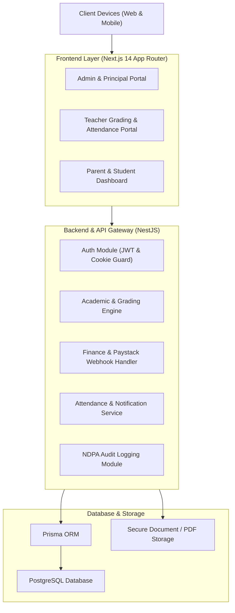

<div align="center">

# Modern School Management System
### Enterprise School Information & Administrative Platform

*A modular, multi-tenant ready school management system designed for Nigerian primary and secondary institutions.*

[](https://nextjs.org)
[](https://nestjs.com)
[](https://www.typescriptlang.org)
[](https://www.prisma.io)
[](https://www.postgresql.org)
[](https://tailwindcss.com)
[](LICENSE)

---

A production-grade, full-stack school management system built specifically for the Nigerian educational ecosystem. Covers student and staff information, automated termly grading and broadsheet generation, fee payments with Paystack, attendance logging, behavior tracking, and administrative governance compliant with the **Nigeria Data Protection Act 2023 (NDPA)**.

</div>

---

## Core Modules

| Module | Description | Key Capabilities |
|---|---|---|
| **Auth & RBAC** | Role-Based Access Control | Granular access for Super Admin, Principal, Teachers, Accountants, Parents, and Students. |
| **Student Information (SIMS)** | Student Lifecycle Records | Enrollment, biodata, classroom allocation, guardian records, and health information. |
| **Staff & HR Management** | Educator & Employee Directory | Subject assignment, department structuring, payroll profiles, and activity tracking. |
| **Academics & Grading** | Examination & Assessment Hub | Continuous Assessment (CA1, CA2), Exam scoring, automated broadsheets, and printable report cards. |
| **Fee Collection & Billing** | Financial Accounting | Termly school fees, levies, Paystack hosted checkout integration, manual cash reconciliation, and receipt generation. |
| **Attendance Tracking** | Daily Registry System | Morning and afternoon attendance marking, excused absence tracking, and automated parent SMS alerts. |
| **Multilingual Support** | Localization Engine | Full interface and notification support in English and Hausa (`next-intl`). |

---

## System Architecture



---

## Role-Based Access Control (RBAC)

| Role | Student Management | Attendance | Grading & Reports | Fee Billing | System Configuration |
|---|---|---|---|---|---|
| **Super Admin** | Full Access | Full Access | Full Access | Full Access | Full Access |
| **Principal** | Full Access | View & Approve | Review & Sign | View Reports | Manage Academic Terms |
| **Teacher** | View Assigned Class | Mark Daily | Enter CA & Exam Marks | No Access | No Access |
| **Accountant** | View Basic Data | No Access | No Access | Full Billing & Receipts | No Access |
| **Parent** | View Own Children | View Records | View Report Cards | Pay Online & View History | No Access |
| **Student** | View Own Profile | View Records | View Term Results | View Invoices | No Access |

---

## Security & Regulatory Compliance

- **Role-Based Enforcement:** Strictly validated at the NestJS API controller and service layer.
- **Session Security:** Short-lived JWT access tokens with secure `httpOnly` and `SameSite` refresh cookies.
- **Audit Logging:** Permanent, immutable audit trails on all grade modifications, financial entries, and attendance overrides.
- **Payment Compliance:** Payment processing uses Paystack hosted checkout and cryptographic webhook verification; zero card details are stored locally.
- **Data Protection:** Architectural compliance with the **Nigeria Data Protection Act 2023 (NDPA)** regarding student and minor data handling.

---

## Project Structure

```
modern-school-management-system/
├── apps/
│   ├── web/                     # Next.js 14 frontend application (React, Tailwind)
│   │   ├── src/app/             # App router pages (admin, teacher, parent portals)
│   │   ├── src/components/      # UI components, data tables, report card templates
│   │   └── src/lib/             # API client, auth utilities, localization
│   └── api/                     # NestJS backend API service
│       ├── src/modules/auth/    # Authentication and RBAC guards
│       ├── src/modules/students/# Student enrollment and profile services
│       ├── src/modules/grades/  # Assessment, broadsheet, and report card generators
│       └── src/modules/finance/ # Invoicing, receipts, and Paystack integration
├── prisma/
│   ├── schema.prisma            # Relational PostgreSQL database schema
│   └── seed.ts                  # Initial school setup and demo dataset seed script
├── S.A.D folder/                # System Analysis & Design specifications
│   ├── school-management-system-prd.md   # Product Requirements Document
│   ├── school-system-build-spec.md       # Module build specifications
│   └── school_prd_full_erd.html          # Entity Relationship Diagram (ERD)
├── .env.example                 # Environment variables configuration template
└── package.json                 # Monorepo workspaces and script definitions
```

---

## Getting Started

### Prerequisites
- [Node.js](https://nodejs.org) (v18 or higher)
- [PostgreSQL](https://www.postgresql.org) (v14 or higher) or Docker
- `npm` or `pnpm`

### Installation & Local Setup

1. **Clone the repository:**
   ```bash
   git clone https://github.com/SageerAuwal/modern-school-management-system.git
   cd modern-school-management-system
   ```

2. **Install monorepo dependencies:**
   ```bash
   npm install
   ```

3. **Configure environment variables:**
   ```bash
   cp .env.example .env
   ```
   *Update database credentials, JWT secret keys, and Paystack API keys in `.env`.*

4. **Run database migrations and seed:**
   ```bash
   npx prisma migrate dev --name init
   npx prisma db seed
   ```

5. **Start development servers:**
   ```bash
   # Run all workspaces concurrently
   npm run dev
   ```
   - **Frontend (Web):** `http://localhost:3000`
   - **Backend API:** `http://localhost:4000/api`

---

## Author

**Sageer Auwal**  
Federal University of Kashef, Gombe State  
Faculty of Science and Computer Science  

---

## License

This project is **proprietary software**. All rights reserved.

Copyright (c) 2026 Sageer Auwal. All rights reserved.

---

<div align="center">

**Empowering educational administration through robust technology**  
*Modern School Management System — Designed for Nigerian Educational Institutions*

</div>
